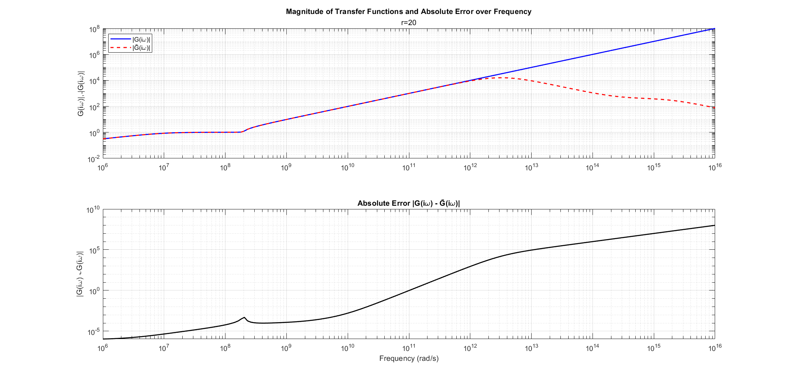

# MOR-Descriptor-Systems-IRKA

## Overview

This project implements and evaluates variants of the  
**Iterative Rational Krylov Algorithm (IRKA)** for model order reduction of large-scale descriptor systems (DAEs) arising from circuit models.

The objective is to construct reduced-order models (ROMs) that approximate the transfer function of the original full-order models (FOMs), while significantly reducing computational complexity.

This work was developed as part of a seminar on  
**Model Reduction and Numerical Simulation**.

---

## Implemented Algorithms

The repository contains multiple IRKA-based implementations designed for descriptor systems with singular matrices.

### `IRKA_D.m` — Standard Descriptor IRKA

This function implements the classical IRKA method for descriptor systems where the matrix **E** is singular.

Characteristics:

- Standard IRKA formulation for descriptor systems
- No explicit polynomial part matching
- Serves as a baseline implementation
- Used for comparison with modified methods

Limitations:

- High-frequency errors increase significantly
- Polynomial part mismatch leads to unstable approximation behavior

---

### `IRKA_WCF.m` — IRKA with Spectral Projectors (**Primary Contribution**)

This function represents the **main contribution of the project**.

It implements IRKA using **spectral projectors** to handle the polynomial part of the transfer function in descriptor systems.

Objectives:

- Improve matching of the polynomial part of the transfer function
- Maintain bounded approximation errors
- Improve high-frequency behavior of reduced models

Key Features:

- Uses spectral projector-based formulation
- Designed for descriptor systems with singular **E**
- Improves numerical stability compared to standard IRKA
- Reduces errors caused by polynomial mismatch

---

### `main_IRKA.m` — Execution Script

This script controls the numerical experiments and runs the IRKA workflow.

Responsibilities:

- Loads spectral initialization data
- Generates descriptor system matrices
- Calls IRKA implementations
- Performs iterative updates
- Computes reduced-order models
- Generates performance plots
- Evaluates frequency-domain approximation errors

This file serves as the main entry point of the project.

---

## Numerical Methods

The following numerical techniques were implemented and tested:

- Standard IRKA for descriptor systems
- IRKA with spectral projector-based polynomial matching
- Projection-based model order reduction
- Frequency-domain transfer function approximation
- Error analysis between FOM and ROM
- Monitoring of IRKA convergence

All algorithmic steps and numerical experiments were implemented in **MATLAB**.

System matrices and auxiliary routines for projection matrix computation were provided by the original authors of the reference work.

---

## Numerical Experiments

Experiments were conducted using large-scale descriptor systems originating from circuit models.

### Standard IRKA (`IRKA_D.m`)

The classical IRKA method was applied as a baseline.

Observations:

- The approximation error increased rapidly with frequency
- Errors reached magnitudes up to approximately **10⁸**
- This behavior indicates a mismatch in the polynomial part of the transfer function

These results demonstrate the limitations of standard IRKA when applied to descriptor systems.

---

### Modified IRKA with Spectral Projectors (`IRKA_WCF.m`)

A modified IRKA implementation using spectral projectors was applied to improve polynomial matching.

Observations:

- The approximation error was significantly reduced (approximately **1**)
- The error remained bounded over a wider frequency range
- However, a mismatch between ROM and FOM remained at higher frequencies

---

## Observation


## Discussion of Results

The numerical results show that the reduced-order model (ROM) does not fully match the behavior of the full-order model (FOM), particularly at higher frequencies.

This mismatch is primarily caused by inaccuracies in the computation of the spectral projectors used in the modified IRKA implementation.

Since the spectral projectors are not computed exactly, the polynomial part of the transfer function is not matched perfectly between the FOM and the ROM. As a result:

- The polynomial parts of the transfer functions differ between FOM and ROM
- High-frequency behavior is not reproduced accurately
- The ROM error increases in frequency regions where polynomial matching is critical

These observations highlight the sensitivity of interpolatory projection methods to the numerical accuracy of spectral projector computation.

---

## Example Configuration

Typical experiment parameters:

- Original system dimension: **n ≈ 1499**
- Reduced model dimension: **r ≈ 20**
- System type: Descriptor systems from circuit models

---

## Execution & Requirements

To run the simulations, the following proprietary components  
(provided by the original authors) are required:

- `rcl_ind2.m`  
  System generator for circuit descriptor models

- `Bode_500_10_1e8_1e-8.mat`  
  Pre-computed spectral data used for initialization

### Steps to Run

1. Ensure the proprietary files are available in the MATLAB path
2. Place repository files in the working directory
3. Run:

```matlab
main_IRKA
